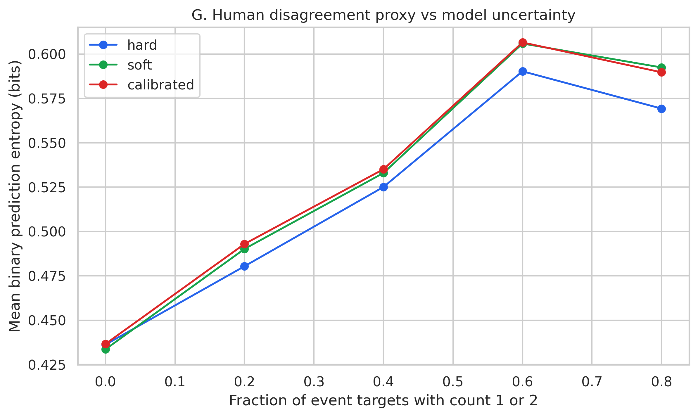

# StutterSense

**Annotator-aware, multi-label stuttering event detection with frozen WavLM representations.**

StutterSense investigates whether preserving disagreement among human annotators improves classification, probability calibration, and uncertainty estimation compared with majority-vote labels. The complete experiment lives in a single, portable Jupyter notebook and streams the public [`psusac/sep28k`](https://huggingface.co/datasets/psusac/sep28k) dataset directly from Hugging Face.

> This is an exploratory research project, not a clinical diagnostic system.



## Results at a glance

The included reference run used 2,000 clips, seed 42, and a duplicate-aware 70/15/15 clip split. All results use a fixed 0.5 threshold.

| Training target | Macro F1 | Micro F1 | Macro AUROC | Soft-target Brier ↓ | Soft-target ECE ↓ |
|---|---:|---:|---:|---:|---:|
| Majority-vote BCE | 0.1853 | 0.3651 | 0.8091 | 0.0595 | 0.0279 |
| Soft-target BCE | 0.2645 | 0.4045 | 0.8281 | 0.0549 | 0.0160 |
| Soft BCE + Brier penalty | **0.2713** | **0.4148** | **0.8287** | **0.0547** | **0.0157** |

Soft-target training improved annotator-proportion calibration and thresholded classification in this run. The difference between the two soft-target variants is small and should not be interpreted as conclusive. Majority-label ECE moved in the opposite direction, illustrating that calibration must be defined against the intended target.

See [the full experiment summary](results/experiment_summary.md), [comparison table](results/comparison_table.csv), and [per-class metrics](results/per_class_metrics.csv).

## Research design

The five independent event labels are:

- prolongation
- block
- sound repetition
- word repetition
- interjection

Each label is an aggregate annotation count from 0 to 3. The notebook compares:

```text
hard target = 1[count >= 2]
soft target = count / 3
```

All model variants share the same frozen `microsoft/wavlm-base-plus` embeddings, duplicate-aware split, MLP architecture, initialization seed, optimizer budget, and validation-only early stopping. Model C adds a documented soft-target Brier penalty to soft-label BCE.

Evaluation covers macro/micro F1, per-event precision/recall/F1, AUROC, average precision, hard- and soft-target Brier scores, separate calibration errors, predictive entropy, uncertainty/ambiguity association, and selective risk–coverage.

## Quick start

Python 3.11 is recommended. A CUDA-capable GPU is strongly recommended for feature extraction; the classifier itself is lightweight.

```bash
git clone <your-repository-url>
cd StutterSense
python3 -m venv .venv
source .venv/bin/activate
python -m pip install --upgrade pip
python -m pip install -r requirements.txt
jupyter lab StutterSense.ipynb
```

On Windows PowerShell, activate the environment with `.venv\Scripts\Activate.ps1`. For a platform-specific CUDA build of PyTorch, follow the [official PyTorch installation selector](https://pytorch.org/get-started/locally/) before installing the remaining requirements.

Run the notebook from top to bottom. It requires internet access for the streamed dataset and public WavLM checkpoint, but it does not require API keys, mounted storage, manually uploaded data, or local project modules.

### Smoke-test modes

The configuration cell provides two smaller modes:

- `FAST_SMOKE_TEST = True`: 64 clips and at most two epochs.
- `CPU_SMOKE_TEST = True`: 32 clips, batch size two, and one epoch on CPU.

Generated files go to `outputs/` by default. Override this with the `STUTTERSENSE_OUTPUT_DIR` environment variable.

## Repository layout

```text
StutterSense.ipynb       Complete end-to-end experiment
requirements.txt         Runtime dependencies
requirements-dev.txt     Validation/development dependencies
results/                 Curated metrics, provenance, and figures from the reference run
scripts/validate_repo.py Static notebook and result-integrity checks
.github/workflows/       Continuous validation on GitHub
```

Checkpoints, embedding caches, raw data, ZIP archives, and future `outputs/` directories are intentionally ignored by Git. The existing local binary artifacts can be regenerated from the notebook.

## Validate the repository

```bash
python -m pip install -r requirements-dev.txt
python scripts/validate_repo.py
```

The validator checks notebook structure and Python syntax, rejects platform-specific paths, verifies the reference result schemas and split integrity, and confirms that every expected figure is a valid high-resolution PNG.

## Limitations

- The hosted default subset does not expose verified speaker or episode identifiers. The included evaluation is duplicate-aware but not speaker-disjoint and may contain speaker leakage.
- Counts of 1 and 2 are a proxy for disagreement; individual annotator identities and reliability are unavailable.
- The 2,000-clip subset comes from a reproducibly shuffled streaming buffer and is not guaranteed to be a perfectly uniform sample of the full hosted split.
- Results come from one split and one seed. They do not establish statistical significance or external validity.
- Predictive entropy mixes data ambiguity, model fit, and prevalence; it is not a pure estimate of epistemic uncertainty.
- Fixed 0.5 thresholds yield low recall for several rare events. Validation-tuned thresholds are available but disabled in the reference run.

## Contributing

Bug reports and research-methodology improvements are welcome. Please run `python scripts/validate_repo.py` before opening a pull request. See [CONTRIBUTING.md](CONTRIBUTING.md) for the expected workflow.

## License

Released under the [MIT License](LICENSE).

