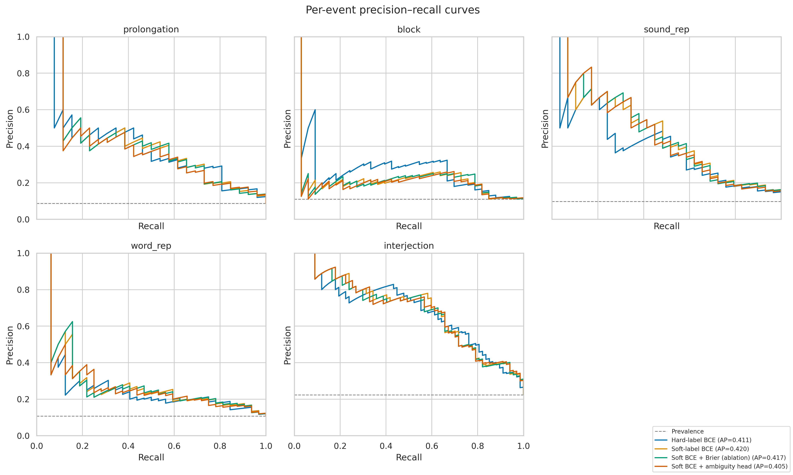

# StutterSense

Annotator-aware, multi-label stuttering-event detection using frozen WavLM representations. The project is experimental research software, not a clinical diagnostic tool.

## Results

The validated [full-stream run](results/README.md) scanned 21,856 hosted rows and sampled 2,000 clips with zero decoding failures. It used one seed and a 1,400/300/300 train/validation/test split.

| Model | Macro F1 at 0.5 | Macro F1 tuned | Macro AP | Soft Brier ↓ | Soft ECE ↓ |
|---|---:|---:|---:|---:|---:|
| Hard BCE | 0.2514 | **0.4142** | 0.4112 | 0.0644 | 0.0533 |
| Soft BCE | **0.2787** | 0.4015 | **0.4213** | **0.0607** | 0.0165 |
| Brier ablation | 0.2626 | 0.4031 | 0.4203 | 0.0609 | **0.0156** |
| Ambiguity multi-task | 0.2506 | 0.4081 | 0.4139 | 0.0611 | 0.0169 |

- Tuned macro-F1 differences between alternative objectives and hard BCE had bootstrap intervals containing zero.
- Soft-label variants improved soft-target Brier score relative to hard BCE.
- The ambiguity head reached mean per-event AUROC 0.7046 for intermediate annotation counts, similar to event entropy at 0.7034.
- No verified speaker or episode IDs were available, so speaker leakage may remain.

| Precision–recall | Risk–coverage |
|---|---|
|  |  |

## Method

Five independent event targets are derived from annotation counts:

```text
hard target      = 1[count >= 2]
soft target      = count / 3
ambiguity target = 1[count in {1, 2}]
```

The notebook provides:

- full-stream reservoir sampling with pinned dataset and model revisions;
- duplicate-aware splitting and verified identity grouping when available;
- fixed and validation-selected per-event thresholds;
- per-event PR, AP, confusion, calibration, and quality analyses;
- ambiguity, entropy, prevalence, and random risk–coverage rankings;
- configurable seeds and paired dependence-group bootstrap intervals;
- optional manifest-gated FluencyBank evaluation.

The BCE+Brier model is a regularization ablation, not an uncertainty model.

## Run in Google Colab

1. Upload [`StutterSense.ipynb`](StutterSense.ipynb).
2. Select **Runtime → Change runtime type → T4 GPU**.
3. Select **Runtime → Run all**.

No Google Drive or local audio is required. The setup cell preserves Colab's preloaded scientific stack. If an older notebook caused a NumPy import error, select **Runtime → Disconnect and delete runtime** before running this version.

For a quick non-research check, set `FAST_SMOKE_TEST=True`. For stronger variability estimates, set multiple seeds, for example `EXPERIMENT_SEEDS=[42, 123, 456]`.

## Run locally

Python 3.11 is recommended.

```bash
git clone <repository-url>
cd StutterSense
python3 -m venv .venv
source .venv/bin/activate
python -m pip install --upgrade pip
python -m pip install -r requirements.txt -r requirements-dev.txt
jupyter lab StutterSense.ipynb
```

Generated files go to `outputs/` locally and `/content/stuttersense_outputs/` in Colab. Set `STUTTERSENSE_OUTPUT_DIR` to override the location.

## Validation

```bash
python -m pip install --index-url https://download.pytorch.org/whl/cpu "torch>=2.2,<3"
python -m pip install -r requirements-test.txt
python scripts/validate_repo.py
python -m unittest discover -s tests -v
```

CI validates the notebook, the committed revised run, and 14 synthetic tests without downloading the dataset or WavLM.

## Data and licensing

The notebook uses the [`psusac/sep28k`](https://huggingface.co/datasets/psusac/sep28k) mirror and records its resolved commit. The [official SEP-28k release](https://github.com/apple-aiml-research/ml-stuttering-events-dataset) lists CC BY-NC 4.0 for the dataset while original audio remains copyrighted by podcast owners. Project code is MIT-licensed; third-party data, audio, and model weights retain their own terms. WavLM terms are listed on the [`microsoft/wavlm-base-plus` model card](https://huggingface.co/microsoft/wavlm-base-plus).

FluencyBank evaluation is disabled by default. Access requirements are documented by [TalkBank](https://talkbank.org/fluency/access.html).

```bibtex
@inproceedings{lea2021sep28k,
  title={SEP-28K: A Dataset for Stuttering Event Detection from Podcasts with People Who Stutter},
  author={Lea, Colin and Mitra, Vikramjit and Joshi, Aparna and Kajarekar, Sachin and Bigham, Jeffrey P.},
  booktitle={ICASSP},
  year={2021}
}
```

## Repository

```text
StutterSense.ipynb   Reproducible Colab/local experiment
results/             Revised metrics, provenance, and figures
tests/               Synthetic unit and smoke tests
scripts/             Offline repository validation
```

See [CONTRIBUTING.md](CONTRIBUTING.md) for development guidance and [LICENSE](LICENSE) for the project license.
