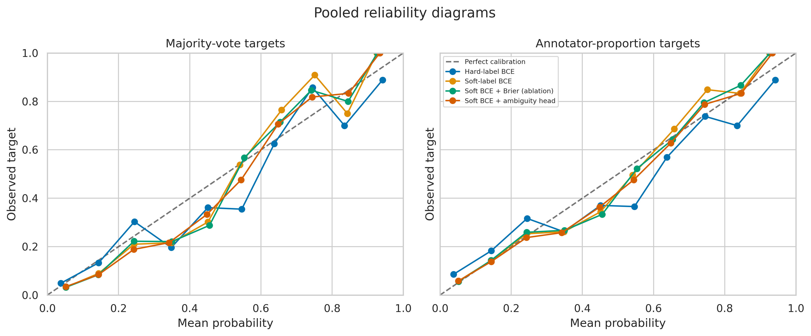
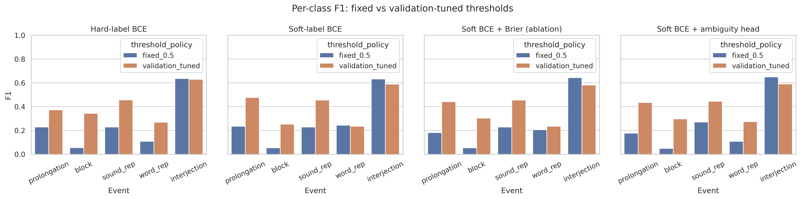
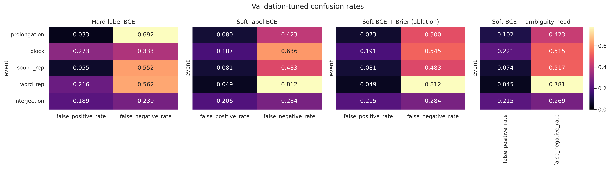

# Reference run

This directory contains the human-readable outputs from the completed 2,000-clip reference run executed on October 7, 2026.

## Configuration

- Dataset: `psusac/sep28k`, `default`, `train`
- Sample size: 2,000 successfully decoded clips
- Split: 1,400 train / 300 validation / 300 test
- Seed: 42
- Encoder: `microsoft/wavlm-base-plus`, frozen
- Classifier: 768 → 256 → 5 MLP
- Threshold policy: fixed 0.5

The exported provenance predates repository-level dataset-revision pinning, so it records the retrieval time and verified schema but not the exact Hugging Face commit hash.

## Contents

- `comparison_table.csv` and `per_class_metrics.csv`: primary evaluation results
- `evaluation_metrics.json`: machine-readable summary and per-class metrics
- `risk_coverage.csv` and `ambiguity_uncertainty.csv`: uncertainty analyses
- `config.json`, `dataset_provenance.json`, `split_indices.json`, and `thresholds.json`: run metadata
- `training_histories.json`: train/validation objectives by epoch
- `figures/`: 300-DPI research visualizations

Local checkpoints (`*.pt`) and the WavLM embedding cache (`*.npz`) are generated artifacts and are not versioned. The committed tables, provenance, and figures are the historical reference.

These outputs describe a duplicate-aware clip-level exploratory split, not a verified speaker-disjoint evaluation.

## Selected figures

| Calibration | Selective prediction |
|---|---|
|  |  |

| Per-class classification | Error analysis |
|---|---|
|  |  |
