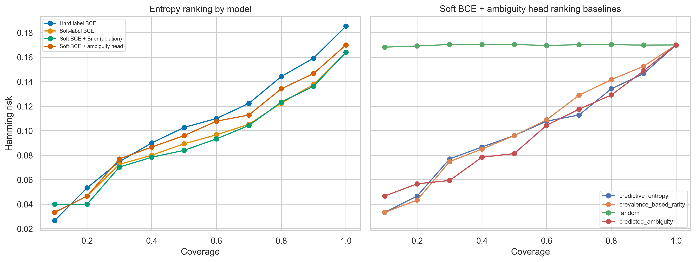

# Full-stream run — 2026-10-08

Validated Google Colab run on an NVIDIA A100 with seed 42.

## Configuration

| Item | Value |
|---|---|
| Dataset | `psusac/sep28k@67630930030046543194dc7c701b87b2cdc7680f` |
| Encoder | `microsoft/wavlm-base-plus@4c66d4806a428f2e922ccfa1a962776e232d487b` |
| Sampling | 2,000 clips from a complete 21,856-row reservoir scan |
| Decoding | 2,000 successful; 0 failed |
| Split | 1,400 train / 300 validation / 300 test |
| Models | Hard BCE, soft BCE, Brier ablation, ambiguity multi-task |
| Evaluation | Fixed 0.5 and validation-selected thresholds; 1,000 bootstrap replicates |

## Test results

| Model | Threshold | Macro F1 | Micro F1 | Macro AUROC | Macro AP | Soft Brier ↓ | Soft ECE ↓ |
|---|---|---:|---:|---:|---:|---:|---:|
| Hard BCE | 0.5 | 0.2514 | 0.3855 | 0.7995 | 0.4112 | 0.0644 | 0.0533 |
| Hard BCE | Tuned | **0.4142** | 0.4372 | 0.7995 | 0.4112 | 0.0644 | 0.0533 |
| Soft BCE | 0.5 | **0.2787** | 0.3831 | **0.8008** | **0.4213** | **0.0607** | 0.0165 |
| Soft BCE | Tuned | 0.4015 | 0.4384 | **0.8008** | **0.4213** | **0.0607** | 0.0165 |
| Brier ablation | 0.5 | 0.2626 | 0.3784 | 0.8005 | 0.4203 | 0.0609 | **0.0156** |
| Brier ablation | Tuned | 0.4031 | 0.4409 | 0.8005 | 0.4203 | 0.0609 | **0.0156** |
| Ambiguity multi-task | 0.5 | 0.2506 | 0.3684 | 0.7951 | 0.4139 | 0.0611 | 0.0169 |
| Ambiguity multi-task | Tuned | 0.4081 | **0.4420** | 0.7951 | 0.4139 | 0.0611 | 0.0169 |

Threshold-independent metrics repeat across threshold policies. Full precision is available in `metrics_by_seed.csv`.

## Findings

- Macro-F1 bootstrap intervals for alternative objectives versus hard BCE included zero.
- All soft-label variants improved soft-target Brier score versus hard BCE.
- The ambiguity head's mean per-event AUROC was 0.7046, similar to event entropy at 0.7034.
- The Brier ablation had the lowest soft ECE but did not improve soft Brier or macro F1 over soft BCE.

## Limitations

This is a single-seed, single-split result. The schema contained no speaker or episode IDs, and all sampled audio hashes were unique; speaker leakage may remain. Quality-filter training and external FluencyBank evaluation were disabled. The findings do not establish clinical or speaker-independent performance.

## Files

Primary tables are `metrics_by_seed.csv`, `per_class_metrics.csv`, `calibration_by_event.csv`, `thresholds.csv`, and `paired_group_bootstrap.csv`. Configuration, provenance, sample identifiers, splits, and histories are included alongside 13 figures. `artifact_manifest.json` records the ignored local checkpoints and embedding cache.

| Precision–recall | Risk–coverage |
|---|---|
|  |  |
